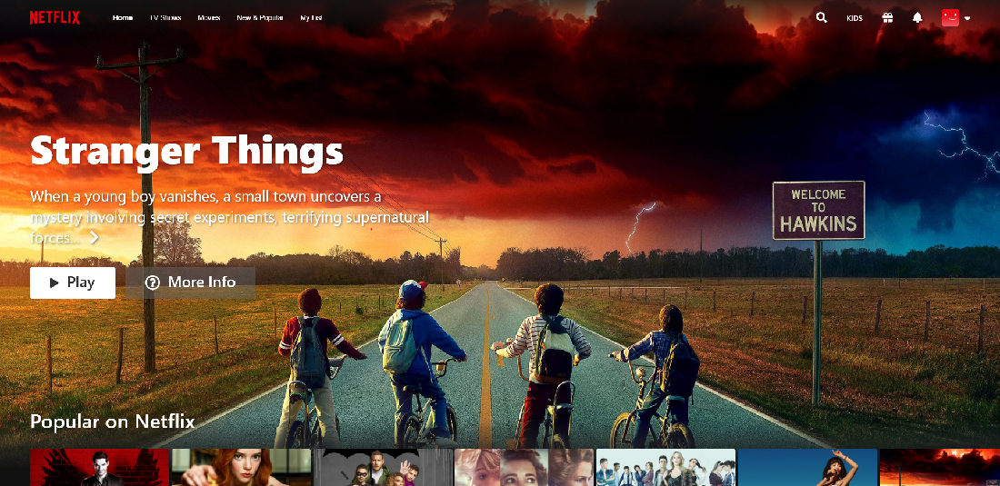

# Netflix Clone
> Harvard CS50 Web Track Final Project | by Ahmet Alper (https://github.com/ahmetalpergit)

<<<<<<< HEAD
=======
# 

>>>>>>> 372be14... finish readme content
Welcome to the documentation of my final project for Harvard's CS50 Course. You'll find pretty much all the information you need on this project but if you still have any questions contact me @ <ahmetalperwork@gmail.com>

### Technologies

HTML - CSS - JS - React - NPM - Git - Firebase

### Libraries

* [axios](https://www.npmjs.com/package/axios)
* [react-youtube](https://www.npmjs.com/package/react-youtube)
* [movie-trailer](https://www.npmjs.com/package/movie-trailer)

```sh
   npm i axios react-youtube movie-trailer
```

### API
[TMDB](https://www.themoviedb.org/)
<<<<<<< HEAD
1. Register for the website and verify your e-mail
2. Settings > API
=======
1. Register for the website and verify your e-mail.
2. Settings > API.
>>>>>>> 372be14... finish readme content
3. [Documentation](https://developers.themoviedb.org/3/getting-started/introduction) for making requests.

### Introduction

Hi, my name is Ahmet and I’m a Turkish citizen, living in Poland for the past 5 years. It’s the year 2020, and as you all know we’re in a global state of pandemic. As COVID has turned us all into couch potatoes, watching Netflix all day long, I’ve decided it would be a cool idea to create a clone of Netflix using one of the popular front-end frameworks as my Harvard final project. 

### Overview

Although my web app looks and feels like Netflix, it functions differently. Since I can't create a database with full movies of every title, I decided to play trailers of the movies instead. For this reason I'm using the react-youtube and movie-trailer libries.

With the data I fetch from TMDB, I populate my react components with relevant information, and let movie-trailer find the youtube path, and react-youtube takes that path and creates a Youtube iframe within the app once a poster is clicked.

Finally I've added responsive styling to keep the design experience smooth on various devices.
<<<<<<< HEAD
=======

### Project Architecture

# 

Kept it simple, from top to bottom there were 3 major components: the Nav-bar, the hero banner and varying category of rows. I've built these sections and used props for things I wanted to change within similar components. The ID were used for Row pagination and fetchUrl was for grabbing category specific content.

### Features

* Looks near identical in terms of styling to the current version of Netflix.
* Dynamically updated content as it works with the movie database API.
* Plays trailers of the titles. 
* Overlay section to see more info about the titles.
* 100% Responsive, all the way down to the smallest phone screens!

## Thank you!

Really appreciate that you've come this far checking out my project. I'd like to give special credit to Harvard CS50 course instructor David J. Malan, Angela Yu (App brewery full stack web dev bootcamp) and Jonas Schmedtmann (advanced CSS and advanced JS courses) who've all taught me things along the way that helped me build this project today. Take care and I'll see you on the next one! :)
>>>>>>> 372be14... finish readme content
